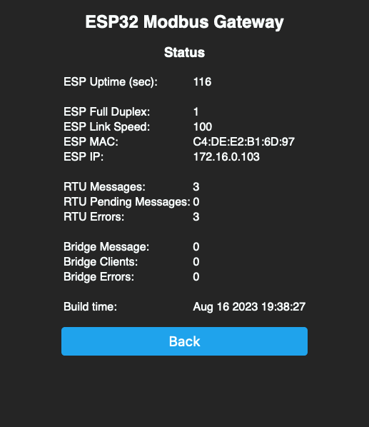
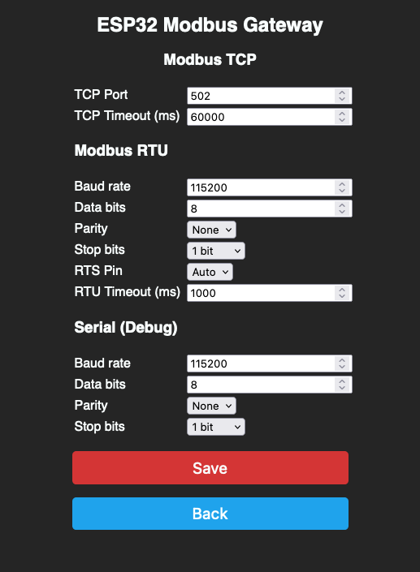

# ESP32 Modbus RTU/TCP Gateway

A generic firmware for an ESP32 to be used as a Modbus TCP/IP gateway for any modbus RTU device.
Default RX/TX pins for the TTL-RS485 communication are used from hardware-serial2 (check pinout of your esp32-board for UART2-TX and UART2-RX).
If you like to use different RX/TX pins, you can define them as build_flags in the platformio.ini.
E.g.:
    build_flags = -DRX_PIN=14 -DTX_PIN=5 

## State

It work's for me, but there's room for improvement. If you have an idea please open an issue - if you can improve anything just create a PR.

## Hardware

### ESP32 NodeMCU + XY-017 TTL-RS485 Board with automatic flow control

## Fork Information

This fork has the following changes:

 * Added support for Ethernet boards(In my case WT32-ETH01)
 * Replaced debug function with functions from eModbus
 * Cosmetic fixes for the WebUI
 * Added support for different Serials objects
 * Added support for less than 247 Modbus addresses
 * Added support for a custom RTU timeout
 * Better debug messages

## Screenshots

### Home

### Status

### Config

### Debug

