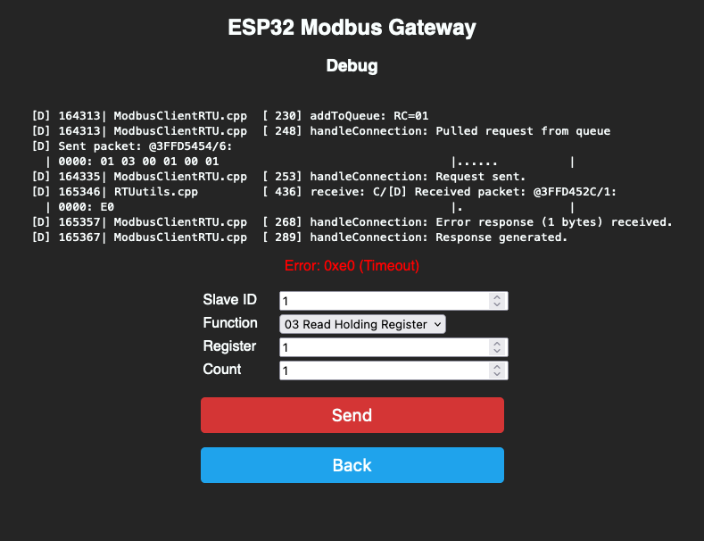

# ESP32 Modbus RTU/TCP Gateway

A generic firmware for an ESP32 to be used as a Modbus TCP/IP gateway for any modbus RTU device.

## State

It work's for me, but there's room for improvement. If you have an idea please open an issue - if you can improve anything just create a PR.

## Screenshots

### Home

### Status

### Config

### Debug

